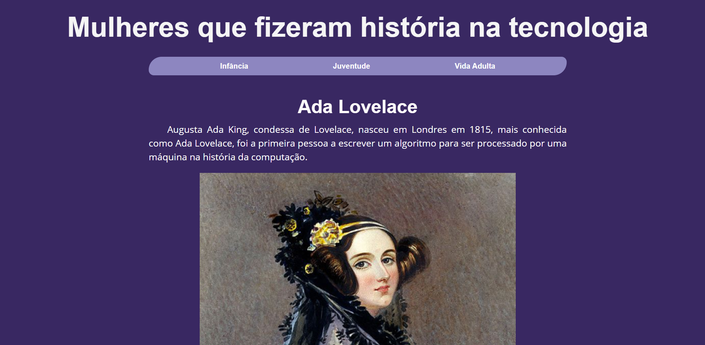

# Site Ada Lovelace

### Atividade prática de criação de página estática com HTML, CSS e JS para o curso Eu Programo da [PrograMaria](https://www.programaria.org/).

#

## Construído com:

* HTML;
* CSS;
* Javascript;
